# Harness-Everything 架构演进 v2：一个下午的九次转弯

> Version: v2（叙事版） | Date: 2026-04-21 | Companion to: architecture-evolution-2026-04-21.md

> v1 文档讲 **"做了什么"**——哪些文件改了、哪些参数翻倍了、哪条路径加了校验。
> 这篇 v2 讲 **"怎么走到那一步的"**——从 18:23 看 pipeline 继续在 6-7 分之间震荡，到 20:54 收尾那一刻，中间经过了**至少九次明确的转弯**：两次诊断、两次加能力、一次工具安全侧线、一次死循环危机、一次"config 够不够"的自我修正、一次放手、一次整理。
>
> 六个 commit，但心路不止六步。

---

## 0. 起点：一个"跑得动但不涨分"的下午

下午 18:23 开始，pipeline 在 GDC_Bots 上连续跑了 15 轮：

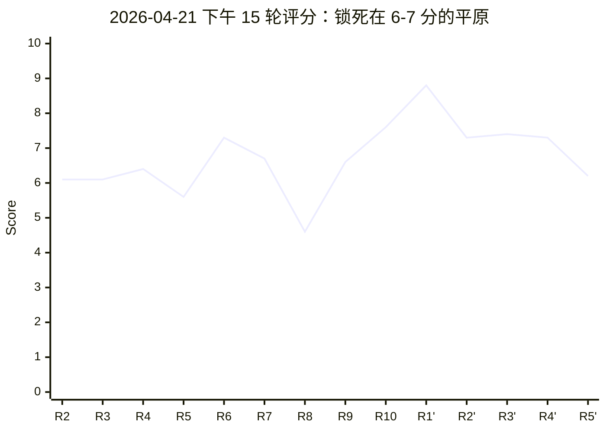
**Figure 0.1 — 15 轮评分轨迹。R1' 那个 8.8 的尖刺是唯一的例外，后面 4 轮立刻被拉回 6-7 区间**

这不是"失败"——代码能跑、工具能用、commit 能落盘。真正让我坐不住的是**分数曲线像被锁死在 6-7 分中间**。Memory 里躺着早已写好的那一条 `project_intelligence_ceiling_observed`——"DeepSeek meta-reasoning ceiling, structural interventions don't redirect tunnel-vision"。

换过参数、换过 prompt、重跑了无数轮之后，我得换一个角度问问题：**不是 LLM 不行，是不是我给它的流程让它"做得了工作但做不成事"？**

---

## 1. 诊断：Pipeline 的五个设计缺口

我没先去改代码。我先让 Claude **排查 planner、evaluator、memory、patience 四个模块**，找出"为什么改注释也能拿 7.7 分"的结构性原因。找出五个：

| # | 缺口 | 具体位置 | 症状 |
|:---|:---|:---|:---|
| 1 | **评分没有"实际影响"维度** | `dual_evaluator.py` 的 8 个维度全是技术质量（correctness / completeness / caller impact / rollback safety...） | 没有一项问"这个改动对项目有用吗"。改注释也能 specific、correct、low risk → 7.7 分 |
| 2 | **Memory 不追踪 files_changed** | `MemoryEntry` 只记 score / insight / defect | Round 2 不知道 Round 1 改了什么，每轮重新盯住同一批文件 |
| 3 | **文件排序是确定性的** | `score_file_relevance()` 用 phase 关键词排序 | 同样的关键词 + 同样的文件 = 每轮排序一模一样，没有"最近改过的文件降权" |
| 4 | **Patience 只看涨跌不看幅度** | `if round_score > best_round_score: no_improve_count = 0` | 改空格涨 0.1 分也重置 counter。无限循环永不打破 |
| 5 | **Falsifiable criterion 太松** | "Changes must fix a specific issue OR remove verified dead code" | "specific issue" 没要求严重性，删个没用的 import 就"过关"了 |

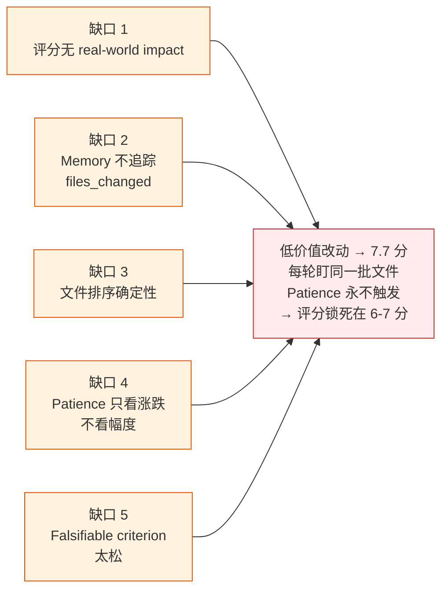
**Figure 1.1 — 五条独立的设计缺口共同汇成同一个症状："智能在空转"**

诊断完这一刻，主基调定了：**不是智能不够，是智能在空转**——每轮 LLM 确实在做"技术上正确的事"，但我的引导机制把它的注意力一次次送回同一批文件、同一类小改动。

这个诊断是今天所有改动的出发点。后面所有的转弯，都是在反复回答一个问题：**怎样才算给了 LLM 一个"做大事"的环境？**

---

## 2. 第一次转弯：让看代码的角色能看见代码

### 2.1 症状
诊断之后最刺眼的发现是：**orchestrate 和 review 这两个 debate phase 是"瞎子"**。它们只能看被动注入的 `$file_context`（50K+ 字符）——你以为 orchestrator 在规划，其实它在**对着半本书说话**；你以为 reviewer 在评审，其实它看不到真实 diff，只能基于 implementer 的自述打分。

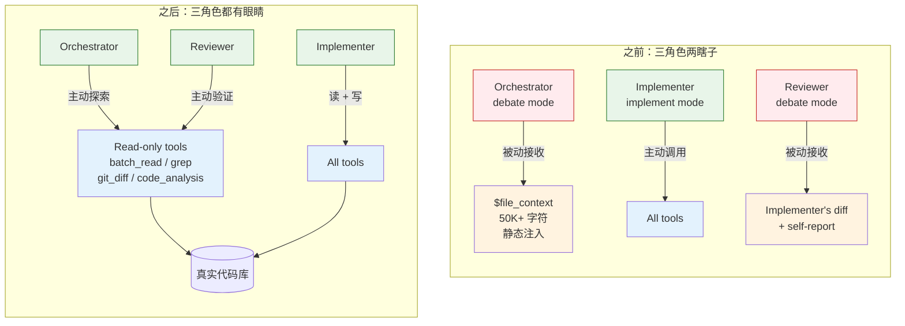
**Figure 2.1 — 三角色的工具访问权对比。之前只有 implementer 能主动碰代码；之后所有 debate 角色默认都拿到只读工具**

只有 implement 角色配了工具。这个分工当初的潜台词是"debate 是推理，不用碰代码"——但**真实的规划和评审从来都需要主动查代码**。

### 2.2 改动
在 `phase_runner.py` 引入 `_READ_ONLY_TAGS`：

```python
_READ_ONLY_TAGS = frozenset({"file_read", "search", "git", "analysis"})
```

覆盖大约 20 个工具（read_file、grep_search、git_diff、code_analysis、cross_reference 等）——**所有 side-effect-free 的探索类工具**。

关键的语义翻转：
- **之前**：`tool_tags` 指定"哪些工具可用"，没指定就是没工具
- **现在**：所有 agent 默认拥有全部只读工具；`tool_tags` 的语义变成"额外开放哪些写/执行工具"

改法是抽 `_build_active_registry(phase)` 统一给 debate 和 implement 两条路径用，同时删掉 `_run_debate_round()` 里"有 `tool_tags` 才用 call_with_tools、没有就纯文本 `llm.call()`"的 if/else 分支——**debate 模式永远走 call_with_tools**，orchestrator 和 reviewer 从此拥有眼睛。

debate 的 `max_tool_turns` 限到 30（debate 不该跑 200 轮），但**能探索**这件事本身就是质变。

### 2.3 代价
装了眼睛之后立刻暴露了下一个问题：**agent 想探索，但每次只能一个文件一个文件读**。想追一条调用链要 5-8 次 tool call，每次都是一次 LLM round-trip。这就接到了下一个转弯。

---

## 3. 侧线：工具安全审查（顺手找到了几个真 bug）

在"给所有 agent 装眼睛"之前，我先花时间审了一遍工具实现——理由是：**开放度一上来，原本不构成威胁的边界 bug 就变成真威胁**。审的结果比预期要多：

| # | 发现 | 严重性 |
|:---|:---|:---|
| 1 | `_find_path_by_inode` 在 `base.py` 重复定义两次（line 427 + 810），两份实现略有差异 | 维护隐患 |
| 2 | `bash.py` 的 `_denied_command()` 只检查第一个 token。`echo hi && rm -rf /` 通过检查 | **安全漏洞** |
| 3 | `search_glob` / `search_grep` 结果没做 `allowed_paths` 校验。符号链接可指向 workspace 外 | **安全漏洞** |
| 4 | `read_file` 空结果 header 显示 `lines 100-99 of 50`（倒序范围） | LLM 困惑 |
| 5 | `grep_search` 无文件上限，大 repo 上同步阻塞 + 可能 OOM | 性能 / 稳定性 |
| 6 | `search_glob` 返回绝对路径（vs `search_grep` 返回相对路径，不一致） | LLM context 浪费 |

前三项特别关键——**在 pipeline 老架构下这几个漏洞都是"理论上存在"**，因为 debate 没工具、implement 的 LLM 不主动写 `echo && rm`、glob 很少被调用。一旦 debate 拿到工具、agent 会一次 `glob_search("**/*.py")`，**这些潜伏 bug 直接从"理论"变"现实"**。

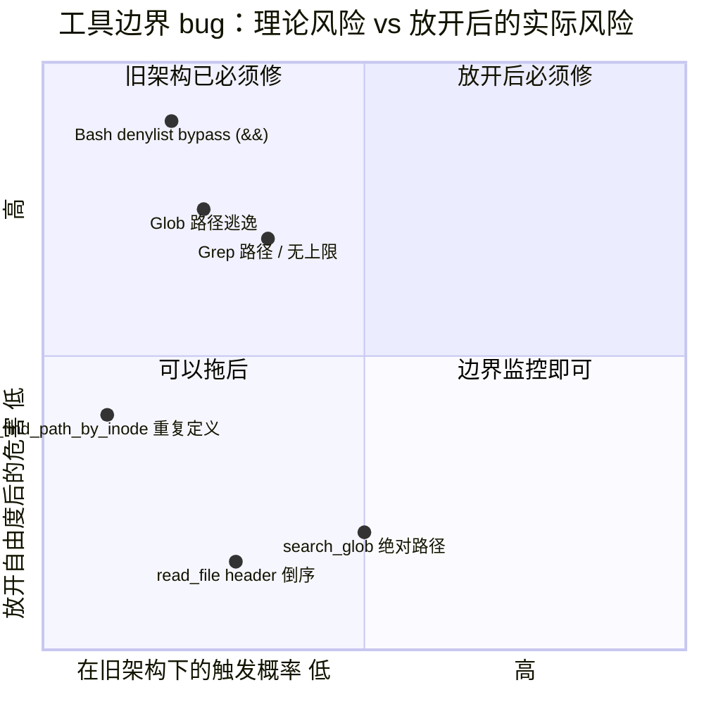
**Figure 3.1 — 六个发现按"触发概率 × 危害"分布。三个位于右上（放开后必须修）的漏洞，正好是**严格**要求在 commit `4e2a8ac` 里一起补上的**

修法写在 `4e2a8ac` 那个 commit 里，但思路链是这条：**决定要放开之前，先把会被放开暴露的边界 bug 补齐**。这不是事后补救，是放开之前的必要前置条件。

---

## 4. 第二次转弯：Batch 工具——让"多做一点"成为一次工具调用

### 4.1 症状（承接第 2 节）
Debate agents 有了眼睛，但**眼睛太慢**。orchestrate 想知道 `pending_reset_id` 在哪几个文件里出现：要么 5 次独立 `read_file`，要么先 `grep_search` 再逐个 `read_file`。每次都是一次 LLM round-trip。

日志里数出的 `tool_loop turn=X` 大半都是"打开→读→切到下一个→再读"这种机械动作。**LLM 的脑力不是花在想，是花在翻页**。

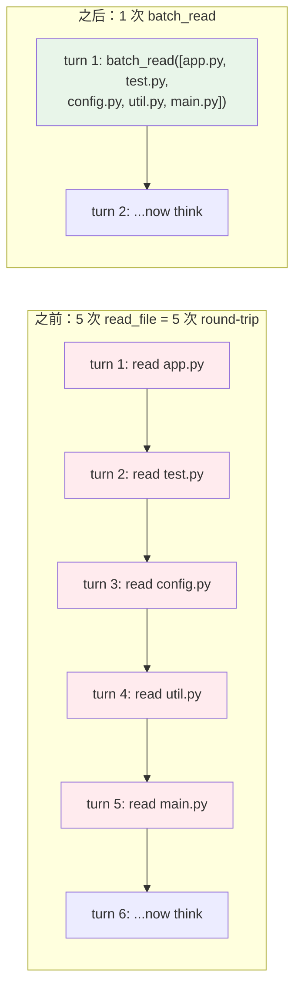
**Figure 4.1 — 追一条调用链：5 次 round-trip vs 1 次 batch**

### 4.2 改动：三个批量工具
- `batch_read`——一次最多 50 个文件，总字符上限 500K
- `batch_edit`——一次最多 100 处编辑（每条指定 `path` + `old_str` + `new_str`）
- `batch_write`——一次最多 50 个新建/覆写

然后在 `tools/__init__.py` 里干了一件更重要的事——**主次换位**：
- `BatchReadTool` / `BatchEditTool` / `BatchWriteTool` / `ScratchpadTool` → **默认注册**
- `ReadFileTool` / `EditFileTool` / `WriteFileTool` → **标注 `"superseded by batch_*"`，默认不注册**

> 这不是"新增工具"，是"让单文件工具变成 opt-in"。`extra_tools: ["read_file"]` 才会挂回去。

### 4.3 为什么不保留单文件工具作为默认
如果两套都默认注册，LLM 会**交替用两种工具**，而缓存层（`_CachedToolRegistry` 的 `_read_cache`）只按 `read_file` 的 `(path, offset, limit)` 建键——**batch_read 和 read_file 的缓存不共享**。同一文件被两条路径各读一次，缓存失效。主次换位的深层理由是缓存一致性，不只是精简工具表。

---

## 5. 第三次转弯（危机）：批量工具自己撞上了"读→裁→重读"死循环

### 5.1 症状：看起来更快，实际更糟
batch 工具上线跑 pipeline——**更糟了**。日志显示单次 inner round 烧掉了 913K-1.2M input token，30 轮 tool turn 全被吃光，proposal 评分跌到 1.1 和 0.4。

细看工具调用：
```
executor.py          被 batch_read 了 ~12 次
reflection_engine.py 被读了 ~8 次
replan_orchestrator.py 被读了 ~6 次
```

同一批文件在**一个 inner round 内**被反复读。为什么？

### 5.2 根因链
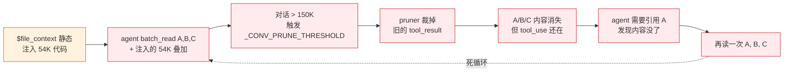
**Figure 5.1 — 死循环的六步：每一步本身合理，合在一起自我毁灭。日志实测：executor.py 被读 12 次、reflection_engine 被读 8 次、单 inner round 烧 1.2M token**

```
1. agent 读 A → 读 B → 读 C    [上下文累积]
2. 对话超过 _CONV_PRUNE_THRESHOLD (150K)
3. pruner 裁掉旧的 tool_result（A 的内容）
4. agent 想引用 A 的内容 → 发现没了
5. 再读一次 A  →  ... goto 1
```

更讽刺的是 debate prompt **本来还被动注入了 54K 的 `$file_context`**——**agent 又用 batch_read 读了差不多的文件**，两份内容叠加直接撑爆上下文，pruner 不得不出手，agent 不得不重读。

**我给了它眼睛、给了它翻页更快的手，但同时给了它一个会自动擦白板的教室**。

### 5.3 三管齐下的解药

**药一：debate 有工具时，注入 manifest 而不是 content**

`_read_source_manifest()` 替代 `_read_source_files()` 注入到 `$file_context`：
```
## Available source files (23 files)
  bridge/dispatcher/app.py  (18,400 bytes)
  bridge/dispatcher/task_planner.py  (11,100 bytes)
  ...

Use batch_read or read_file to inspect files you need.
```

清单 ~2K 字符 vs 全量 ~54K 字符。**有工具的 agent 不该吃被动投喂**，给目录让它自选。

**药二：缓存命中时返回短提示，不返回内容**

`_CachedToolRegistry` 命中时输出改成：
> *"[Already read — app.py (18400 chars). Content was shown earlier. Use your notes or work from memory. If you need a specific section, use offset/limit.]"*

这一步治标：不再把大段内容追加到对话里。但 agent 如果真的忘了内容细节，它就**只能去查笔记**——也就需要第三味药。

**药三：Scratchpad——不受对话修剪影响的笔记本**

Scratchpad 工具，LLM 调用写笔记，**笔记注入 system prompt**（而非对话体），对话修剪永远动不到。工具 description 里硬点出用法：

> *"Save important findings as persistent notes that survive context pruning. Do NOT re-read files to recall information; save notes here instead."*

**药四（副作用）：阈值翻倍**

`_CONV_PRUNE_THRESHOLD` 150K → **300K**，`TARGET` 100K → **200K**。**用来让 pruner 晚一点出手**——不是不 prune，是在 agent 真正需要时才裁。

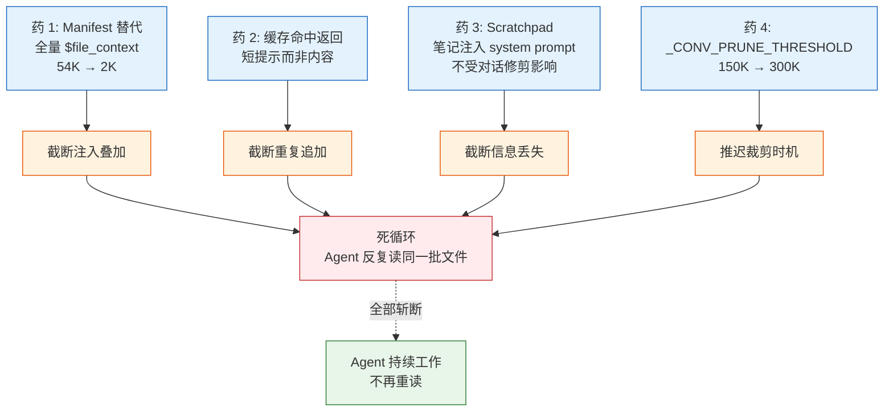
**Figure 5.2 — 四味药各斩断死循环里的一个环节。缺任一味都会让循环从剩下的环节里重新形成**

这四味药合在一起，**死循环的每一个环节都被截断了**——不该注入的别注入、该有缓存的缓存住、该持久的笔记持久、该晚裁的晚裁。

### 5.4 这一轮的真正教训
批量工具**不是孤立的性能优化**。它改变了 LLM 在一个 turn 里塞进对话的信息密度，整个上下文生存策略必须随之重写。**"更大的工具" + "没变的上下文管理" = 加速崩溃**。

---

## 6. 第四次转弯：加速每一轮——并行执行 + 信号量

### 6.1 问题
LLM 一个 turn 里返回 5 个 tool_use block，旧代码 `for tc: await execute(tc)` 挨个等。5 个 `batch_read` 串行 = `5 × I/O-latency`，但只读操作本来完全可以并行。

Debate 的 `asyncio.gather(inner_rounds)` 已经在跑 3 个 LLM 并发，dual evaluator 又 2 个，高峰 5+ 并发——proxy 的 rate limit 要炸。

### 6.2 改动
**并行只读**：定义 23 个只读工具白名单（`batch_read`、`grep_search`、`glob_search`、`git_*`、`code_analysis` 等）。一个 turn 内的 tool call 分三类：
- `scratchpad` → 同步处理（纯内存操作）
- 只读工具 → `asyncio.gather()` 并发
- 变更工具（`batch_edit`、`batch_write`、`bash`）→ 顺序 await

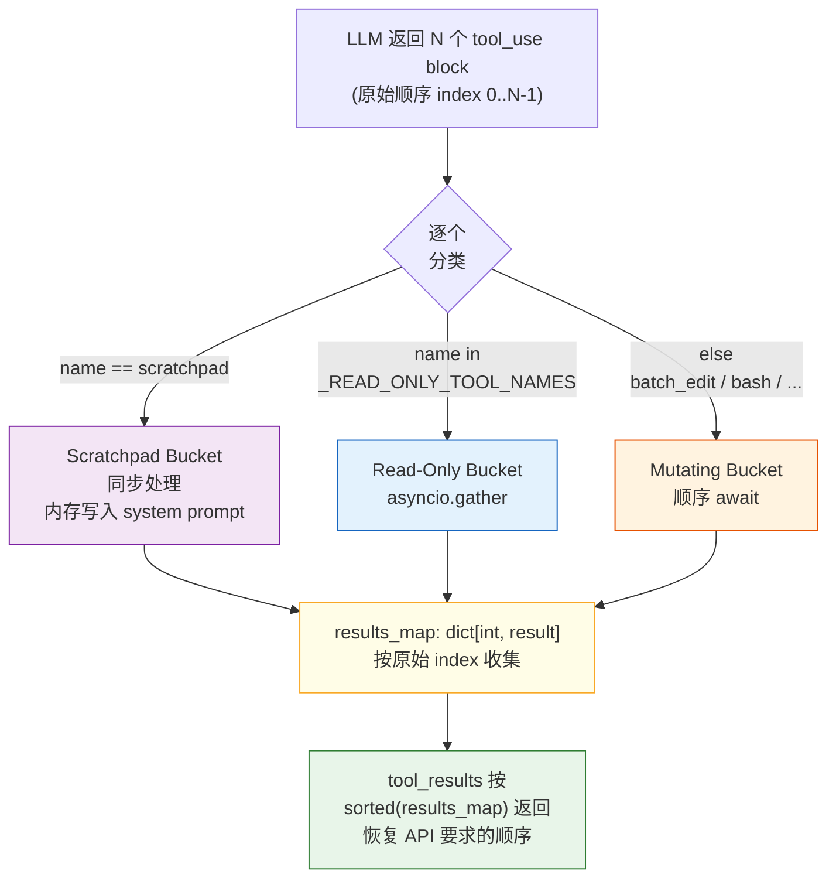
**Figure 6.1 — 三桶分发 + 按原始 index 重排。并行但最终顺序一致是 Anthropic API 的硬要求**

关键点：**`tool_result` 最终要按原 `tool_use` 顺序返回**（Anthropic API 硬要求），所以用 `results_map: dict[int, dict]` 按原始索引存，最后 `sorted(results_map)` 取出。

**LLM 并发节流**：`LLM.__init__` 里建 `asyncio.Semaphore(max(1, min(config.max_concurrent_llm_calls, 20)))`，所有 `call()` 都在 `async with self._api_semaphore:` 里。默认 4 并发。

### 6.3 观察到的效果
日志里开始出现：
```
parallel_tools: 3 read-only in 0.04s
parallel_tools: 1 mutating in 0.06s
```
原来 3 × 30ms 的串行压到 ≈ 30ms。

这一刀和上一刀（死循环解药）合并在同一个 commit `42d5871` 里——**它们是同一个问题的两个方向**：上下文里每一个 byte 都值钱，工具调用里每一毫秒都值钱。

---

## 7. 第五次转弯（自我修正）：以为要大改，其实 config + 1 行就够

这一拐在 commit log 里看不到，但在 memory 里留了深深一笔（`feedback_prefer_config_over_rewrite`）。

### 7.1 场景
用户问："能不能让 harness 做**功能开发**？比如给 GDC_Bots 加一个 bash 工具？"

我第一反应是："要新增 `feature mode`——需要 `$feature_goal` 模板变量、新的 design phase mode、改 evaluator、改 patience……"——**一套架构级改动清单**。

用户（典型的那种）meta-question：
> *"需要这么多代码吗？"*

### 7.2 回头看一遍 config 能力
我老老实实把 PipelineConfig / PhaseConfig 的每一个字段过了一遍，结果让我自己愣住：

| 需求 | Config 能搞定？ |
|:---|:---|
| 写目标 | ✅ 直接写进 `system_prompt`，每轮注入 |
| 加 design phase | ✅ `phases` 数组加一项 `{name: "design", mode: "debate"}` |
| 改评价标准 | ✅ `dual_evaluator.basic_system` / `diffusion_system` 可改 |
| 改 orchestrate 导向 | ✅ 改 prompt 文本 |
| 增大单轮粒度 | ✅ prompt 加 "break into concrete steps" + `max_tool_turns: 60` |
| 禁用 patience 早停 | ✅ `patience: 0` |
| 定制 meta-review | ✅ `meta_review_system` 可改 |
| 跨轮记忆深度 | ❌ `memory.py` line 239 硬编码 `[:400]` |

**八项需求里七项 config 就够，一项需要 1 行代码改动**。

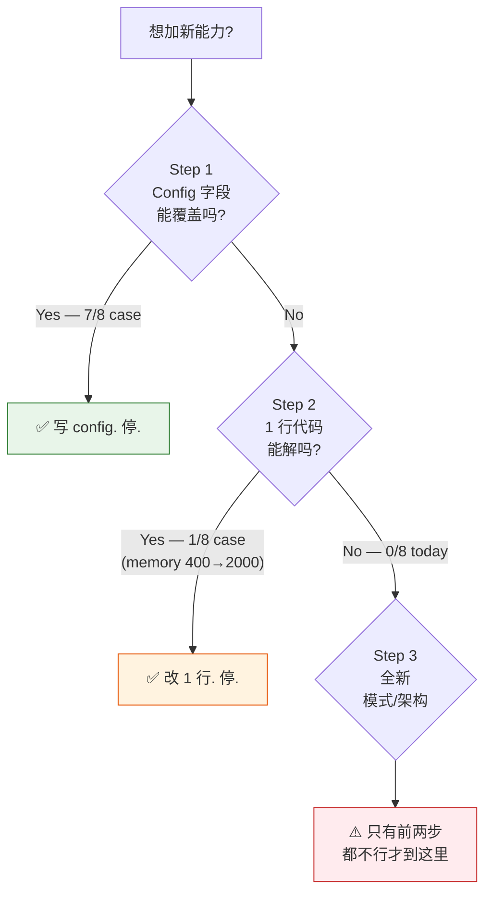
**Figure 7.1 — "config over rewrite" 的三级决策。今天八项需求里，七项停在 Step 1，一项停在 Step 2，零项走到 Step 3**

### 7.3 改动
`memory.py` 那 1 行：
```python
# Before
insight = phase_result.synthesis[:400].replace("\n", " ").strip()

# After
insight_limit = 2000 if any(k in label for k in ("design", "orchestrate")) else 800
insight = phase_result.synthesis[:insight_limit].replace("\n", " ").strip()
```

Design / orchestrate 类 phase 输出动辄 2000+ 字符的设计文档——400 字截断会把关键决策切掉。其他类保持 800 就够。

### 7.4 这次修正的意义
**它是一条元规则**：每次想"大改架构"之前，**先把现有 config 字段全过一遍**。今天真正动的是一行硬编码限制，不是新模式、不是新字段、不是新 phase。

这条规则后来在第 8 节的"agent mode"决策里又救了一次——那次我差点又去设计 TaskTracker 的完整数据模型。

---

## 8. 第六次转弯（真觉悟）：流程本身是瓶颈

### 8.1 那个让我停下来的瞬间
写 batch 工具的 commit message 时，我打字打到一半突然发现：

> *"我给 pipeline 每个 phase 塞了 batch 工具、并行执行、scratchpad、200 轮 turn 预算、manifest 代替全量……那 phase 之间的切换还有意义吗？"*

Pipeline 三角色当初的设计理由是**"一个 LLM 不足以端到端完成复杂任务"**。但现在：
- 单个 phase 能读任何文件
- 单个 phase 能跑任何测试
- 单个 phase 能做任何编辑
- 单个 phase 有 200 轮 turn 预算

**phase 之间的切换不再是分工，是信息的断点**。每换一个 phase 就是"忘记刚才读过什么"。

更扎心的是 Pipeline 的评分机制：正在做大重构的中间步骤会降分，patience=3 就打断——**评分反而成了 tunnel vision 的帮凶**。

### 8.2 考虑但拒绝的选项：TaskTracker
一开始我想的是**沿着 pipeline 加强**：引入 Goal + SubTask 数据结构，meta-review 解析"任务状态更新"关键字，写 `tasks.jsonl` 做进度追踪，patience 改为 "goal_aware_patience"。完整方案写了一份 plan，~220 行新代码 + 5 个文件改动。

让我退回来的是两个问题：

1. **Pipeline 的根本瓶颈是"三次交接"还是"没有任务清单"？**——是前者。加个 TaskTracker 治标不治本，三个半盲的角色拿着任务清单还是三个半盲。
2. **Claude Code 本身是怎么工作的？**——一个 agent 拿着工具连续干，没有 phase 切换，没有评分，靠 git commit 守质量。

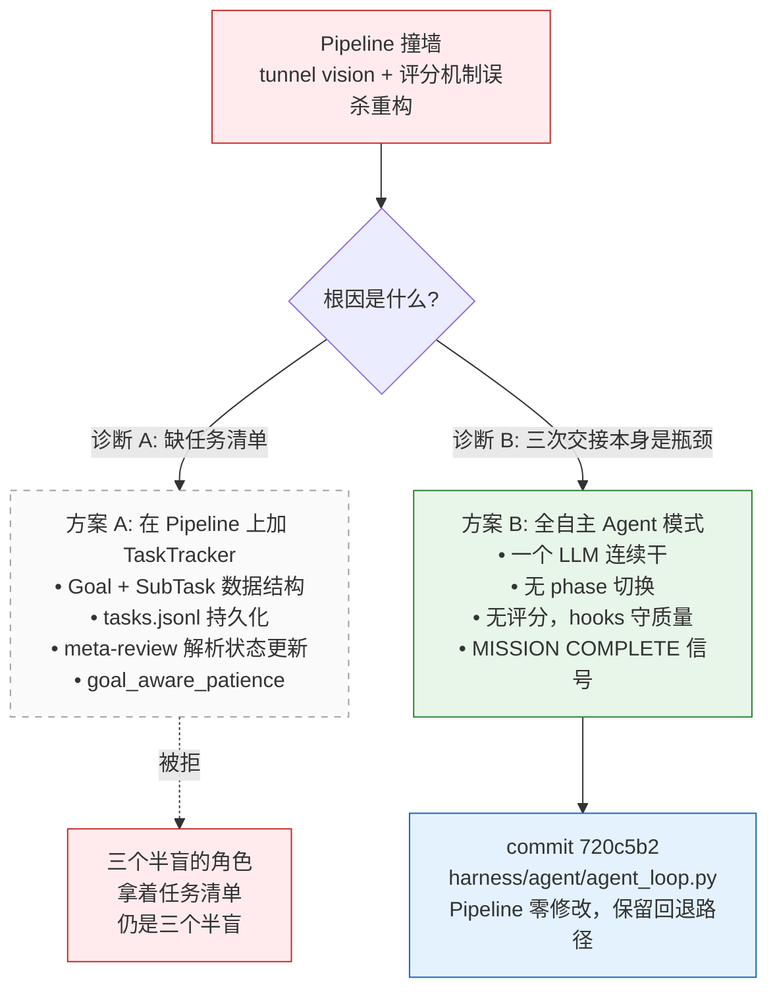
**Figure 8.1 — 分叉口。TaskTracker 方案已经写成 plan（~220 行新代码 + 5 文件），但被上面两个问题打回。关键判断：症状相似，根因分裂——治标 vs 治本**

### 8.3 决定：全自主 Agent 模式
commit `720c5b2`，新增第三种运行模式：
- **不是三角色**，是一个 LLM 从头干到尾
- **不是每轮打分**，而是 hooks（syntax / static / import_smoke）做质量门，通过就 `git add -A && git commit`
- **不是 harness 规定"先规划再执行"**，给一个 `mission`，LLM 自己决定读什么、改什么、什么时候跑测试、什么时候写 scratchpad
- **不是 10 轮 pipeline**，是 **999 个 cycle**，每个 cycle **200 轮 tool turn**，跨 cycle 靠 `agent_notes.md` 做长期记忆
- **不是 evaluator 判定完成**，LLM 自己输出 `MISSION COMPLETE` 或 `MISSION BLOCKED`

我同时删掉了"`max_tool_turns > 200` 触发警告"那段代码。**不再对 LLM 说"你这样不正常"——如果它要跑 500 轮，它自有理由**。

### 8.4 关键的克制：pipeline 保留
Agent 模式是**新增的第三条路**。`pipeline_loop.py` / `phase_runner.py` / `executor.py` / `evaluator.py` **零修改**。原因：
- Pipeline 在短周期、明确评分标准的任务上仍然有价值（修一个 bug、写一个函数，评分是合理信号）
- Memory 那条"config over rewrite"也在这里生效——**留一条回退路径比推倒重来便宜**

Pipeline 没死，只是从"唯一路径"变成"一种选择"。`./harness-gdc.sh start` 现在弹出三模式菜单：**pipeline / agent / simple**。

---

## 9. 第七、八、九次转弯：收尾

### 9.1 放开上限（`a602a86`）
在 agent 模式之前已经提过的，但拼图完整的一块：
- `max_cycles` 50 → **999**
- `max_tool_turns` 30 → **200**
- `max_notes_cycles` 10 → **30**
- `_CONV_PRUNE_THRESHOLD` 150K → **300K**
- `BatchRead.MAX_FILES` 20 → **50**，`MAX_LINES` 500 → **2000**，`MAX_TOTAL_CHARS` 120K → **500K**
- `BatchEdit.MAX_EDITS` 30 → **100**
- 删掉 `max_tool_turns > 200` 的警告

**12 项上限一次性翻倍以上**。理由在第 8 节已讲清：agent 自主编排，人为低上限只会干扰。

### 9.2 安全补漏（`4e2a8ac`）
第 3 节发现的那三个真安全漏洞，在放开 agent 自由度之后**必须补**：
- Bash denylist 按 `&&` `||` `;` `|` 拆段，每段首 token 都查
- Glob / grep 匹配结果逐条 `resolve()` 后验证在 `allowed_paths` 内
- Glob 输出改相对路径，加 5000 文件硬上限

**开放度上去之前堵漏**，不是事后补救。

### 9.3 整理重复（`eee8b4c`）
跨 agent_loop / pipeline_loop / executor / phase_runner 之后，**三份几乎一样的"从 exec_log 提取 changed paths"逻辑**出现了。于是抽 `harness/tools/path_utils.py`。信号处理也有两份，抽 `harness/core/signal_util.py`。

顺带修了一个**真 bug**：`_auto_commit` 里 `git add -A` 调了两次，第一次没 await（创建了孤儿子进程），第二次 await 的才是真正的 add。

再顺手把 batch 工具内部也并行化了——`batch_read` 的 N 个读取 `asyncio.gather`，`batch_write` 同理，`batch_edit` 按 path 分组（同一文件的编辑保持串行避免 read-modify-write 竞争，不同文件并行）。

净减 176 行代码。**开放度上去之后，重复代码才显出来；整理的窗口就是现在**。

```mermaid
gantt
    title 2026-04-21 下午六个 commit 的节奏（34 分钟内落地）
    dateFormat HH:mm
    axisFormat %H:%M

    section 诊断期（无 commit）
    Claude 模拟一轮 + 五缺口诊断          :diag, 19:50, 30m

    section 能力层
    b2b41cf batch tools + demote 单文件  :c1, 20:20, 4m
    42d5871 parallel + semaphore + scratchpad :c2, 20:24, 2m
    a602a86 raise 12 项上限              :c3, 20:26, 4m

    section 架构层
    720c5b2 agent mode 第三运行时         :crit, c4, 20:30, 3m

    section 加固层
    4e2a8ac 安全补漏                      :c5, 20:33, 21m
    eee8b4c path_utils 抽取 + batch 并行化 :c6, 20:54, 5m
```
**Figure 9.1 — 六个 commit 的时间轴。注意：真正的"觉悟"发生在 c4（20:30）——从能力优化跳到架构替换。前三个 commit 是为这一刻铺路，后两个是为这一刻收尾**

---

## 10. 交叉反思：九次转弯其实只围着三个问题转

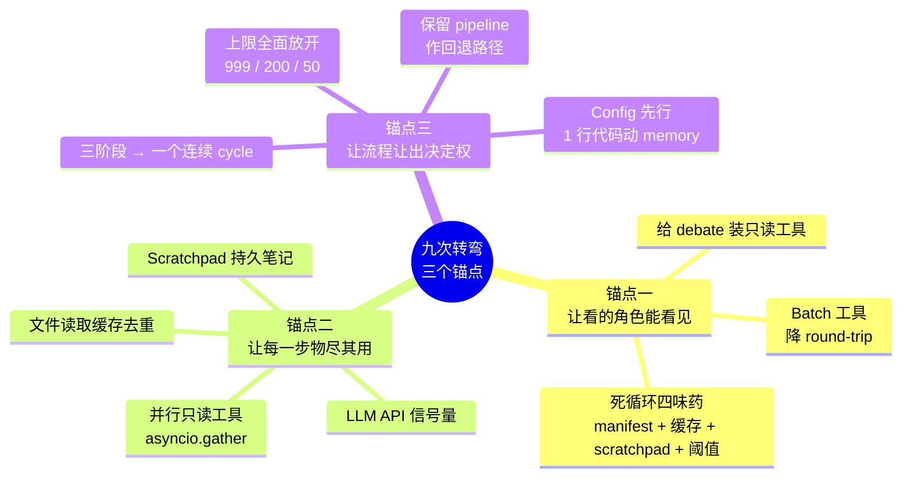
**Figure 10.1 — 九次转弯的三锚点结构**

九次转弯，但本质上只有三个锚点在反复回访：

**锚点一——"让看的角色能看见"**
从给 debate 加只读工具，到 batch 工具，到死循环修复——都是在解决同一句话：**LLM 在推理前应该能自己查代码，而不是被动吃投喂**。每一次修补都把"主动探索"的成本压低一个数量级。

**锚点二——"让每一步物尽其用"**
并行工具、信号量、缓存去重、scratchpad——都是在解决：**一次 tool call 能做几件事？一次 API call 能不浪费吗？一段对话能生存多久？** 上下文、时间、并发三条维度各有各的优化，但合起来是一个目标：**每一个 token / 毫秒 / 并发度都应该长在有用的地方**。

**锚点三——"让流程让出决定权"**
Pipeline 是我设计的"LLM 该先做 A、再做 B、最后做 C"。Memory 的 400 字截断是我决定的"什么重要什么不重要"。Patience 的 `> best` 检查是我决定的"什么时候该停"。**每一次"我替它决定"都是一次约束**。今天的每一次转弯都在去掉一条约束：

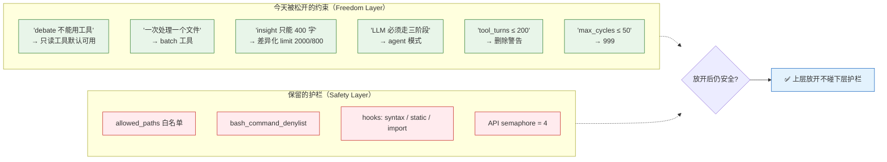
**Figure 10.2 — 自由层放开 vs 安全层不动。每次松一条约束都要问一句：这一层的护栏能接住吗？能→放；不能→补护栏再放（对应第 3/9 节的安全补漏）**

约束一条条松开到最后，就剩下真正的护栏：`allowed_paths`、`bash_command_denylist`、hooks 质量门。

**这九步合起来是一句话：Don't simulate the work, give it the tools.**
不要替 LLM 模拟"工作流"，把做工作的工具给它，然后退开。

---

## 11. 没做完的事

- **Mission 仍然是泛化的"持续改进"**。Agent 模式的真正威力应该在端到端大任务——"重写错误恢复系统"、"把整个 bridge 模块迁到异步"——而不是和 pipeline 重叠的"改进 repo"
- **跨 cycle 评估仍是空白**。没有评分机制是好事（消除 tunnel vision），但 agent 如何判断自己陷入死循环？目前只能靠 hooks + 人工看日志。TaskTracker 的想法被搁置了——但"agent 是否在朝 mission 前进"这个问题还没答案
- **DeepSeek 天花板问题没解**。今天所有改动都是"给 LLM 更大空间"。但如果 LLM 本身的 meta-reasoning 够不到，再大的空间也没用。下一步行动大概率是**换模型**，而不是继续改架构
- **v1 文档和本文是互补的**。v1 是"地图"，本文是"航线图"——不只告诉你终点在哪，还告诉你哪几个路口拐过弯、哪几次差点走错。单看任何一份都是片面的

---

## 12. 给读者的一条经验

如果你在设计 LLM 工作流，今天这一下午九次转弯能给你的一条经验是：

> **先让一个 LLM 假装跑你系统里的每一个角色——每一个 phase、每一次工具调用、每一个切换点。**
> 你会立刻看到哪些工具让它在翻页、哪些流程让它在等待、哪些分工让它半盲。
>
> **然后在改第一行代码之前，把你现有 config 字段过一遍。** 十之八九你以为需要的"新模式"只是没发现的 config 组合。
>
> **只有当 config 真的够不到的时候，再动代码——而且先从 1 行开始**（比如 memory 那个 400 → 2000）。
>
> 今天六个 commit、709 行净增代码、九次转弯——起点全是一次诊断和一次模拟。

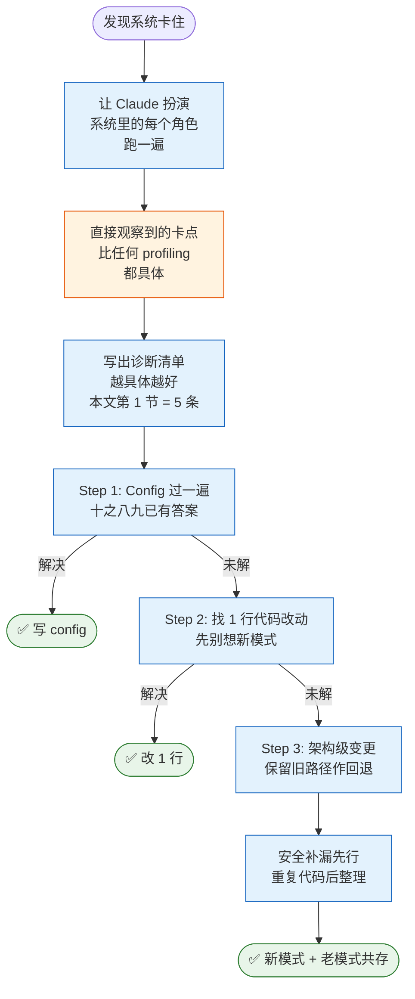
**Figure 12.1 — 这张图是我希望下一次自己陷入类似困境时能记住的流程。从模拟到诊断，从 config 到 1 行代码，只有当这条路彻底走不通时才动架构**
