# Harness-Everything 架构演进：从 Pipeline 到全自主 Agent
> Version: v1 | Date: 2026-04-21 | Author: Harness-Everything 核心开发

## 1. 引言与背景

### 1.1 演进动因
Harness-Everything 最初只有两种运行模式：**Simple**（一次性任务）和 **Pipeline**（多阶段迭代改进）。Pipeline 模式采用固定的三角色分工——编排者出计划、执行者写代码、评审者打分——每一轮需要 3 次以上 LLM 调用，角色间的交接靠文本传递，没有工具访问能力。
这套架构在短周期改进任务上表现稳定，但暴露了三个根本性限制：
- **轮次开销过大**：每轮 3 次 LLM 调用（规划 + 执行 + 评审），加上综合，一轮下来 4-5 次 API 调用。Agent 如果只想"接着写下一个函数"，仍需走完完整评审流程
- **角色切换有摩擦**：编排者无法读代码（只看注入的 `$file_context`），评审者无法运行测试，执行者无法回溯决策。每个角色都是"半盲"的
- **连续工作流不自然**：Pipeline 的 Evaluator 评分对中间步骤不友好——重构可能降分触发 patience 提前终止，而这恰恰是重构必经的阶段

### 1.2 今日变更概览
2026-04-21 这一天的改动覆盖了 Harness-Everything 的多个核心层，涉及 **13 个已有文件修改** 和 **7 个新文件创建**，净增 **709 行代码**。按功能域分为八大板块：

| 功能域 | 核心变更 | 影响文件数 |
|:---|:---|:---|
| 全自主 Agent 模式 | 新增第三种运行模式 | 5 个新文件 |
| 并行工具执行 | 只读工具 asyncio.gather | 1 (llm.py) |
| 上下文管理 | Scratchpad + 对话修剪阈值翻倍 | 2 |
| Batch 工具体系 | 批量读/写/编辑替代单文件操作 | 4 个新文件 + 1 修改 |
| 限制解放 | 12 项上限全面放宽 | 5 |
| 安全加固 | Bash denylist、Glob/Grep 路径校验 | 3 |
| Pipeline 增强 | Debate 获工具访问、Memory 深度提升 | 5 |
| 运维入口 | harness-gdc.sh 三模式选择 | 1 |

### 1.3 设计哲学
这次演进的核心原则是 **"给 Agent 最大的自由"**：
- **不限制 Agent 能做什么**——给它所有工具，让它自己决定读什么、改什么、测什么
- **不限制 Agent 做多久**——999 个 cycle，每个 cycle 200 轮工具调用
- **不限制 Agent 记住多少**——对话修剪阈值翻倍，持久笔记保留 30 个 cycle
- **只在安全边界设卡**——路径校验、命令黑名单、语法检查

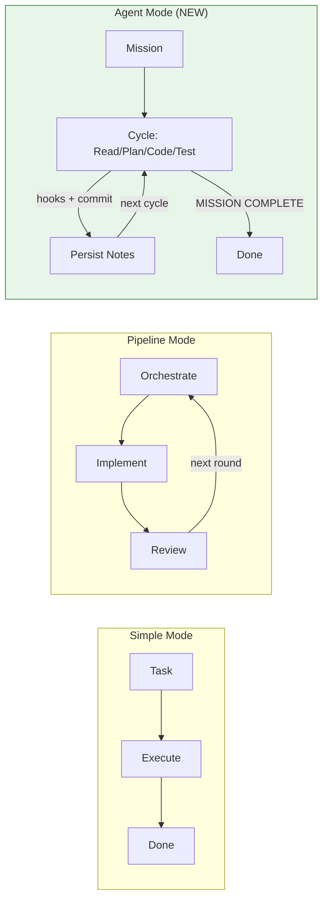
**Figure 1.1 — 三种模式的架构对比**

## 2. 全自主 Agent 模式

### 2.1 为什么不沿用 Pipeline
Pipeline 的三阶段架构（orchestrate → implement → review）设计用于**结构化迭代改进**，每一轮有明确的分工和评分。但对于长程自主任务，这个架构有根本性的不匹配：

| 维度 | Pipeline | Agent |
|:---|:---|:---|
| 一"轮"的成本 | 3-5 次 LLM 调用 | 1 次连续对话 |
| 角色分工 | 强制分离（编排/执行/评审） | 一人全包 |
| 工具访问 | 执行者有工具，其他角色无 | 始终有全部工具 |
| 评分机制 | 双评审打分 0-10 | 无评分，靠 hooks 守质量 |
| 适合场景 | 短周期改进（修 1 个 bug） | 端到端大任务、持续维护 |

Pipeline 模式继续保留，用于需要评分驱动的迭代改进场景。Agent 模式是一个**完全独立的新路径**——零修改 pipeline_loop.py、phase_runner.py、executor.py、evaluator.py。

### 2.2 Agent 与 Pipeline 的本质区别
Pipeline 的一"轮"= **3 个 phase × 多次 LLM 调用**，每个 phase 是一个独立对话，上下文不共享。Agent 的一个"cycle"= **一次连续的 tool-use 对话**，agent 自己决定做什么，上下文在 cycle 内完全连续，跨 cycle 靠持久笔记延续。
类比：Pipeline 像一个三人团队轮流交接，Agent 像一个独立开发者坐在那连续干活。

### 2.3 AgentLoop 核心循环
`AgentLoop` 是 agent 模式的核心引擎，位于 `harness/agent/agent_loop.py`（约 460 行）。它的 `run()` 方法实现了一个简洁的外层循环：

```python
async def run(self) -> AgentResult:
    total_tool_calls = 0
    for cycle in range(self.config.max_cycles):  # 最多 999 轮
        # 1. 构建 system prompt（注入 mission + 持久笔记）
        system = self._build_system(cycle)
        messages = [{"role": "user", "content": self._build_cycle_prompt(cycle)}]

        # 2. 运行 tool-use 循环（最多 200 轮工具调用）
        text, exec_log = await self.llm.call_with_tools(
            messages, self.registry,
            system=system,
            max_turns=self.config.harness.max_tool_turns,
        )

        # 3. 后处理：hooks → commit → persist → 完成检测
        hook_errors = await self._run_hooks(cycle, exec_log)
        if self.config.auto_commit and not hook_errors:
            await self._auto_commit(cycle, text)
        self._persist_cycle(cycle, text, exec_log, hook_errors)

        # 4. 终止条件
        if self._is_complete(text): return AgentResult(success=True, ...)
        if self._is_blocked(text): return AgentResult(success=False, ...)
        if self._shutdown_requested: break

    return AgentResult(success=False, mission_status="partial", ...)
```

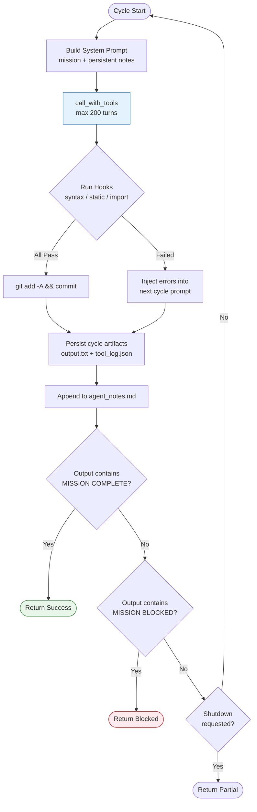
**Figure 2.1 — Agent Cycle 生命周期**

### 2.4 Cycle 内部：call_with_tools 工作流
每个 cycle 就是一次 `call_with_tools()` 调用——与 Claude Code 本身的工作方式相同。LLM 在一个连续的对话中自由使用所有工具：

```
turn 1:  LLM → batch_read(["app.py", "test.py"]) → 返回文件内容
turn 2:  LLM → grep_search("pending_reset") → 返回匹配行
turn 3:  LLM → scratchpad("发现 reset_id 作用域问题...") → 记录笔记
turn 4:  LLM → batch_edit([{path: "app.py", old_str: "...", new_str: "..."}])
turn 5:  LLM → bash("python -m py_compile app.py") → 验证语法
turn 6:  LLM → bash("python -m pytest tests/ -x") → 跑测试
...
turn N:  LLM → 自然停止（不再调用工具）
```

- **工具范围**：Agent 拥有**所有注册工具**——batch_read、batch_edit、batch_write、bash、grep、glob、git 操作、代码分析、scratchpad 等
- **turn 预算**：200 轮。日志中的 `tool_loop turn=20` 就是这个计数器
- **上下文管理**：对话长度超过 300K 字符时自动修剪旧的工具输出，保留最近 3 轮完整内容
- **工具失败处理**：工具返回错误会作为 `tool_result(is_error=true)` 塞回对话，LLM 下一轮看到错误信息后自行调整策略

### 2.5 跨 Cycle 记忆：agent_notes.md
Cycle 内的对话在 cycle 结束时清空（下一个 cycle 是全新对话）。跨 cycle 的记忆靠 **`agent_notes.md`** 文件：

```markdown
## Cycle 1 Summary
- Read dispatcher/app.py, identified phantom tool bug in list_tools exception handler
- Fixed: exception now rejects plan instead of setting available_tools=set()
- Fixed: pending_reset_id now re-read from DB before task creation
- Ran pytest: 45 passed, 0 failed
- Hooks: PASS

## Cycle 2 Summary
- Investigated reflection_engine.py memory assembler integration
- Found: build_compaction_context called without proper context assembler
- TODO next: wire MemoryAssembler into reflection path
- Hooks: PASS
```

**机制细节**：
- 每个 cycle 结束后，从 agent 最终输出提取最后 500 字符作为摘要
- 只保留最近 `max_notes_cycles`（默认 30）个 cycle 的段落，通过正则 `## Cycle \d+` 分割并截取
- 约 5,000-15,000 字符注入 system prompt，不会撑爆上下文
- 文件在磁盘上，进程崩溃重启后 `_read_notes()` 自动加载——零数据丢失

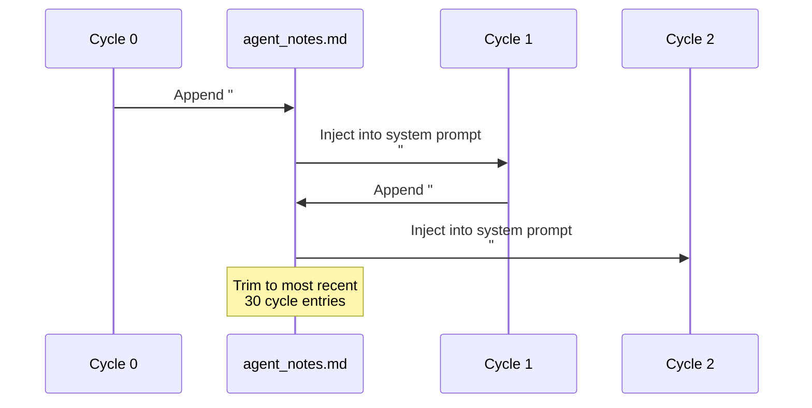
**Figure 2.2 — 跨 Cycle 记忆注入流程**

### 2.6 Cycle 后处理：Hooks → Commit → Persist
每个 cycle 结束后执行三步后处理：

**Step 1 — Hooks 质量门**
```python
cycle_hooks: ["syntax", "static", "import_smoke"]
```
- `SyntaxCheckHook`：对 workspace 内所有 `.py` 文件跑 `py_compile`
- `StaticCheckHook`：检查变更文件的基本静态规则
- `ImportSmokeHook`：尝试 import 变更的模块，确保不会崩溃

Hook 从 exec_log 中提取变更文件列表（扫描 `write_file`、`edit_file`、`batch_edit`、`batch_write` 等工具调用的 path 参数）。

**Step 2 — Auto-commit**（仅当所有 hooks 通过）
```python
async def _auto_commit(self, cycle: int, text: str):
    summary = self._extract_summary(text, None)[:80]
    msg = f"agent: cycle {cycle + 1} — {summary}"
    for repo in self.config.commit_repos:
        # git add -A && git commit --allow-empty -m msg
```
对每个配置的 repo 路径执行 `git add -A` + `git commit`。commit 消息格式：`agent: cycle 3 — Fixed phantom tool exception handler`。

**Step 3 — Persist Artifacts**
```python
artifacts/run_{id}/
  cycle_1/
    output.txt      # agent 最终文本输出
    tool_log.json   # 所有工具调用的完整日志
  cycle_2/
    ...
  agent_notes.md    # 跨 cycle 持久笔记
```

### 2.7 任务完成信号：MISSION COMPLETE / BLOCKED
Agent 通过在输出文本中包含特定标记来发出信号：
- `MISSION COMPLETE: <summary>` — 任务完成，循环终止，返回 success=True
- `MISSION BLOCKED: <what you need>` — 遇到无法解决的阻碍，返回 success=False

检测方式是简单的字符串包含检查（大小写不敏感）：
```python
@staticmethod
def _is_complete(text: str) -> bool:
    return "MISSION COMPLETE" in text.upper()
```

这些标记写在 system prompt 的 Rules 里，LLM 在完成所有任务后自然输出。

### 2.8 崩溃恢复与 ArtifactStore
`ArtifactStore.find_resumable(output_dir)` 在启动时扫描输出目录，寻找可恢复的运行：
```python
existing = ArtifactStore.find_resumable(config.output_dir)
if existing:
    self.artifacts = existing
    log.info("Resuming agent run: %s", self.artifacts.run_dir)
```
由于 `agent_notes.md` 直接在磁盘上，进程崩溃后重启会自动加载之前的笔记，agent 从上次中断的地方继续。

### 2.9 优雅关机
Agent 注册了 SIGINT 和 SIGTERM 信号处理器（与 PipelineLoop 相同模式）：
```python
def _request_shutdown(self) -> None:
    if not self._shutdown_requested:
        self._shutdown_requested = True
        log.warning("Shutdown requested — finishing current cycle...")
```
收到信号后，当前 cycle 会跑完（包括 hooks + commit），然后在循环顶部的 `if self._shutdown_requested: break` 处退出。不会中断正在进行的工具调用或 LLM 请求。

### 2.10 AgentConfig 配置详解
`AgentConfig` 是一个独立的 dataclass，与 `PipelineConfig` 平级：

```python
@dataclass
class AgentConfig:
    harness: HarnessConfig          # 共享的 LLM/workspace/工具配置
    mission: str = ""               # 任务目标（注入 system prompt）
    max_cycles: int = 999           # cycle 上限
    max_notes_cycles: int = 30      # 持久笔记保留 cycle 数
    cycle_hooks: list[str]          # 默认 ["syntax", "static", "import_smoke"]
    auto_commit: bool = True        # 每个 cycle 后自动 commit
    commit_repos: list[str]         # git 仓库路径（相对 workspace）
    output_dir: str = "harness_output"
    run_id: str | None = None       # 自动生成
```

嵌套的 `HarnessConfig` 提供底层控制：
- `max_tool_turns: 200` — 每个 cycle 的工具调用预算
- `max_tokens: 16384` — 每次 LLM 回复的最大 token 数
- `model` — LLM 模型（通过 LiteLLM 路由）
- `bash_command_denylist` — 禁止的 shell 命令
- `allowed_paths` — 文件系统访问白名单

### 2.11 实际运行示例：ExampleProject Agent
当前正在运行的 agent 实例（PID 38266）使用 `config/agent_example_project.json`：

```json
{
  "harness": {
    "model": "bedrock/claude-sonnet-4-6",
    "max_tokens": 16384,
    "base_url": "http://127.0.0.1:9099",
    "workspace": "/home/user/harness/ExampleProject",
    "max_tool_turns": 200,
    "bash_command_denylist": ["rm", "shutdown", "reboot", ...]
  },
  "mission": "You are the autonomous maintainer of ExampleProject...",
  "max_cycles": 999,
  "max_notes_cycles": 30,
  "auto_commit": true,
  "commit_repos": ["."]
}
```

Agent 启动后的实际行为观察（cycle 0，18:13-18:27）：
- turn 1-20：大量读取 `bridge/dispatcher/app.py`，搜索 `pending_reset_id`、`list_tools`、`phantom`
- turn 21-67：深入分析测试文件 `test_phantom_tool_fix.py`、`MemoryAssembler`、`reflection_engine`
- turn 68-69：第一次 `batch_edit` — 修复 `list_tools()` 异常处理（不再假装工具列表为空）
- turn 70：`py_compile` 验证语法通过
- turn 71：`pytest bridge/tests/ -x` 全量测试（30 秒）
- turn 72-77：继续阅读代码，分析更多问题
- turn 78：第二次 `batch_edit` — 修复 `pending_reset_id` 作用域问题
- turn 79：再次 `py_compile` 通过
- turn 80：再次 `pytest` 全量测试（31 秒）
- turn 81+：继续寻找下一个问题

## 3. 并行工具执行引擎

### 3.1 问题：串行执行的瓶颈
在原始实现中，`call_with_tools()` 的每个 turn 里，即使 LLM 返回了 5 个工具调用请求，它们也被**串行执行**。对于典型的"读 5 个文件"场景：
- 5 次文件读取 × 每次 5ms = 25ms（串行）
- 如果走 `asyncio.gather`：≈ 5ms（并行）

更重要的是，当多个 grep 搜索或 git 操作并行时，总延迟从线性叠加变为取最长的那一个。

### 3.2 只读 vs 变更工具分区
在 `harness/core/llm.py` 中新增了 23 个只读工具的白名单：
```python
_READ_ONLY_TOOL_NAMES = frozenset({
    "batch_read", "read_file", "grep_search", "glob_search",
    "git_status", "git_diff", "git_log", "tree", "list_directory",
    "code_analysis", "symbol_extractor", "cross_reference",
    "data_flow", "feature_search", "call_graph", "dependency_analyzer",
    "diff_files", "todo_scan", "json_transform", "tool_discovery",
    "python_eval", "scratchpad",
})
```

分区原则：
- **只读工具**不修改文件系统或外部状态，可以安全并行
- **变更工具**（`batch_edit`、`batch_write`、`bash` 等）可能相互依赖，必须按序执行

### 3.3 三类执行路径
每个 turn 的工具调用被分为三条路径：

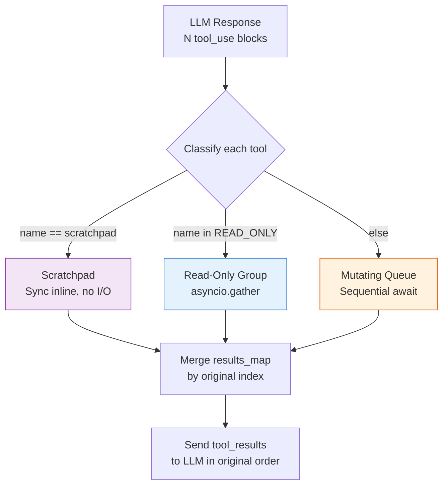
**Figure 3.1 — 并行工具执行流程**

核心代码：
```python
# Scratchpad — 同步处理，无 I/O
if tool_name == "scratchpad":
    result = _handle_scratchpad(tc)
    results_map[i] = {...}
    continue

# 分区
if tool_name in _READ_ONLY_TOOL_NAMES:
    read_only_indices.append(i)
else:
    mutating_indices.append(i)

# 只读工具并行执行
read_results = await asyncio.gather(*read_tasks)

# 变更工具串行执行
for i in mutating_indices:
    result = await cached_registry.execute(...)
```

### 3.4 结果重组：保持 API 顺序
Anthropic API 要求 `tool_result` 的顺序与 `tool_use` 的顺序一致。并行执行打乱了顺序，所以用 `results_map: dict[int, dict]` 按原始索引存储结果，最后按序取出：
```python
tool_results = [results_map[i] for i in sorted(results_map)]
```

### 3.5 LLM API 信号量
Pipeline 的 debate 模式和双评审器可以同时发起 5+ 个并发 LLM 请求。没有节流的话会触发 API rate limit。解决方案是在 `LLM.__init__()` 中创建信号量：
```python
self._api_semaphore = asyncio.Semaphore(
    max(1, min(config.max_concurrent_llm_calls, 20))
)
```
所有 LLM API 调用（`LLM.call()`）都在 `async with self._api_semaphore:` 内执行。默认值 4 意味着最多 4 个并发 API 请求。

### 3.6 性能影响
日志中可以观察到并行执行的效果：
```
parallel_tools: 3 read-only in 0.04s    # 3 个文件读取并行完成
parallel_tools: 1 mutating in 0.06s     # 1 个编辑串行完成
```
对比串行执行（3 × 0.03s = 0.09s），并行将只读操作的耗时压缩到了最长单次操作的时间。

## 4. 对话生存与上下文管理

### 4.1 Context Window 耗尽问题
长程 agent 运行的最大挑战是**上下文窗口耗尽**。每个 turn 的工具结果都塞回对话，一次 batch_read 可能返回几万字符。典型场景：
- 20 轮工具调用后，对话已达 80K+ 字符
- 50 轮后可能超过 150K 字符
- Claude 的 200K token 上下文窗口（约 800K 字符）看似宽裕，但实际可用空间远小于此（system prompt + tools schema + safety margin）

### 4.2 Conversation Pruning 机制
`call_with_tools()` 在每轮工具结果返回后估算对话总字符数。超过阈值时，**截短旧的 tool_result 文本内容**，保持消息结构完整：
```python
if conv_chars > _CONV_PRUNE_THRESHOLD_CHARS:
    _prune_conversation(
        messages,
        target_chars=_CONV_PRUNE_TARGET_CHARS,
        keep_recent_pairs=_CONV_PRUNE_KEEP_RECENT_PAIRS,
    )
```
- 只截短 **文本内容**，不删除或重排消息
- 保留最近 3 对 assistant+user 消息完整
- 每个 `tool_use` block 必须有对应的 `tool_result` block（API 结构要求）

日志中的 `compacted N old tool-result block(s)` 就是修剪在工作。

### 4.3 阈值提升：150K → 300K

| 参数 | 旧值 | 新值 | 含义 |
|:---|:---|:---|:---|
| `_CONV_PRUNE_THRESHOLD_CHARS` | 150,000 | **300,000** | 触发修剪的字符阈值 |
| `_CONV_PRUNE_TARGET_CHARS` | 100,000 | **200,000** | 修剪后的目标大小 |
| `_CONV_PRUNE_KEEP_RECENT_PAIRS` | 3 | 3（不变） | 保留最近完整对话对数 |

翻倍的理由：Agent 模式的 cycle 可能有 200 轮工具调用，需要更大的工作记忆。旧阈值（150K 字符 ≈ 37.5K token）在 50 轮后就开始频繁修剪，导致 agent 丢失早期的重要发现。新阈值推迟修剪时机，让 agent 在更大的上下文窗口中工作。

### 4.4 Scratchpad：LLM 的持久笔记本
即使有修剪机制，被截短的工具输出仍然意味着信息丢失。Scratchpad 工具解决这个问题——agent 可以把重要发现写入笔记，这些笔记**注入 system prompt**，不受对话修剪影响：

```python
# LLM 调用 scratchpad 工具
scratchpad(note="app.py:479 list_tools 异常处理有 bug，
  异常时把 available_tools 设为空集而不是拒绝 plan")

# 笔记注入 system prompt
effective_system = (
    system
    + f"\n\n## Your Exploration Notes ({len(scratchpad_notes)} entries)\n"
    + notes_block
)
```

Scratchpad 工具的描述明确告知 LLM 其用途：
> *"Save important findings as persistent notes that survive context pruning. Do NOT re-read files to recall information; save notes here instead."*

### 4.5 文件读取缓存与去重
`_CachedToolRegistry` 维护两层缓存，避免 agent 反复读取同一文件浪费 token：
- `_read_cache: dict[str, int]` — 记录已读文件的字符数
- `_read_full: dict[tuple, ToolResult]` — 缓存完整的读取结果

当 agent 用 `batch_read` 请求一组文件时，已缓存的文件会被跳过，并附带提示：
> *"File already read (N chars). Save important findings to scratchpad instead of re-reading."*

写工具（`batch_edit`、`batch_write`）执行后会**自动失效**对应路径的缓存，确保下次读到的是最新内容。

### 4.6 Agent Notes：跨 Cycle 的长期记忆
上下文管理形成三个层次，覆盖不同的生存范围：

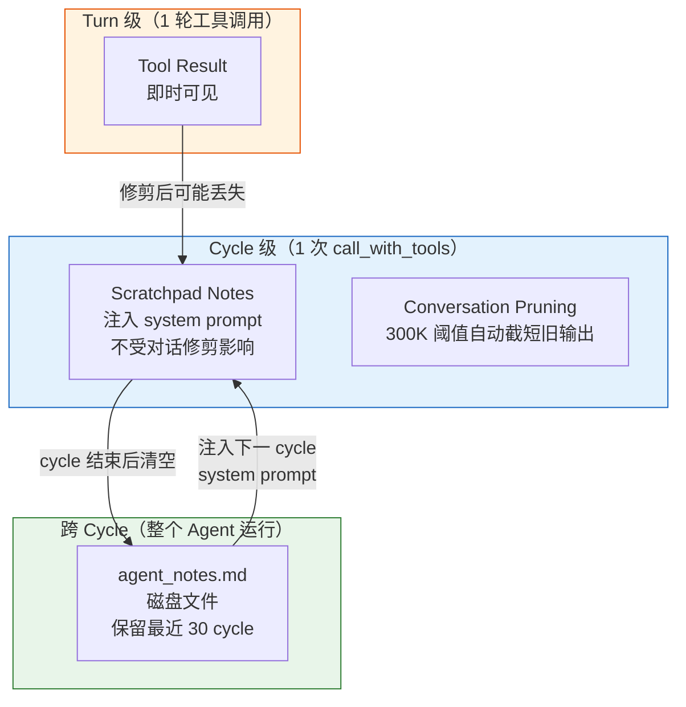
**Figure 4.1 — 上下文管理三层架构**

## 5. Batch 工具体系

### 5.1 从单文件到批量操作
原来的工具设计是每次操作一个文件：`read_file`、`edit_file`、`write_file`。对于 agent 模式——一个 cycle 可能需要读 20 个文件、编辑 10 个文件——单文件操作意味着 30 次工具调用，每次都要一轮 LLM 交互。
Batch 工具将多个同类操作合并为一次调用，节省工具轮次和 token：
- 读 20 个文件：1 次 `batch_read` vs 20 次 `read_file`
- 编辑 10 处代码：1 次 `batch_edit` vs 10 次 `edit_file`
- 创建 5 个文件：1 次 `batch_write` vs 5 次 `write_file`

### 5.2 BatchRead：一次读 50 个文件

| 参数 | 值 |
|:---|:---|
| `MAX_FILES` | 50 |
| `MAX_LINES_PER_FILE` | 2,000 |
| `MAX_TOTAL_CHARS` | 500,000 |

输出格式：
```
Read 3 file(s) (12450 chars total)

--- bridge/dispatcher/app.py [560 lines] ---
    1	import asyncio
    2	import os
    ...

--- bridge/tests/test_phantom.py [45 lines] ---
    1	import pytest
    ...
```

超出总字符预算的文件会被跳过并提示单独读取。

### 5.3 BatchEdit：一次 100 个编辑

| 参数 | 值 |
|:---|:---|
| `MAX_EDITS` | 100 |

每个编辑项需要 `path`、`old_str`（必须在文件中恰好出现 1 次）、`new_str`。编辑逐条应用，每条独立成功或失败，不影响其他条目：
```
Batch edit: 8/10 succeeded, 2 failed
  [1] bridge/app.py: OK
  [2] bridge/app.py: ERROR — old_str appears 3 times, need exactly 1
  ...
```

### 5.4 BatchWrite：一次写 50 个文件

| 参数 | 值 |
|:---|:---|
| `MAX_FILES` | 50 |

每条写入指定 `path` 和 `content`，创建或覆盖文件。适合一次性生成多个模块或测试文件。

### 5.5 工具注册变更：默认与可选
在 `harness/tools/__init__.py` 中，工具的角色发生了调换：
- **新默认工具**：`BatchReadTool`、`BatchEditTool`、`BatchWriteTool`、`ScratchpadTool`
- **降级为可选**：`ReadFileTool`、`EditFileTool`、`WriteFileTool`（标注 "superseded by batch_*"）

Pipeline 和 Agent 模式默认使用 batch 工具。如需单文件工具，可通过 `extra_tools` 配置启用。

### 5.6 缓存集成：读取去重
Batch 工具与 `_CachedToolRegistry` 的缓存层深度集成：
- `batch_read` 请求的路径先查缓存，已读的跳过，只请求未缓存的文件
- `batch_edit` / `batch_write` 执行后自动失效被修改文件的缓存
- 缓存命中时返回提示，引导 agent 使用 scratchpad 而非重复读取

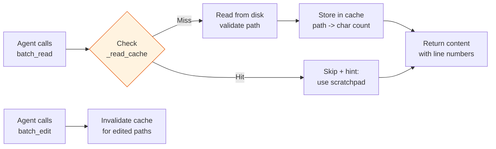
**Figure 5.1 — Batch 工具与缓存交互**

## 6. 限制解放

### 6.1 设计理念：最大自由
用户明确要求：*"不要设置上限，或者上限是 999。人家自己去编排的，给自由，最大的自由"*。核心逻辑是：agent 模式下，LLM 自己决定做什么、做多少、做多久——人为设定的低上限只会干扰它的自主编排。

### 6.2 变更清单

| 限制 | 位置 | 旧值 | 新值 | 影响 |
|:---|:---|:---|:---|:---|
| `max_cycles` | AgentConfig | 50 | **999** | Agent 可运行 999 个 cycle |
| `max_tool_turns` | HarnessConfig | 30 | **200** | 每个 cycle 200 轮工具调用 |
| `max_notes_cycles` | AgentConfig | 10 | **30** | 持久笔记保留 30 个 cycle |
| `_CONV_PRUNE_THRESHOLD` | llm.py | 150K | **300K** | 对话修剪阈值翻倍 |
| `_CONV_PRUNE_TARGET` | llm.py | 100K | **200K** | 修剪目标翻倍 |
| `BatchRead.MAX_FILES` | batch_read.py | 20 | **50** | 一次读 50 文件 |
| `BatchRead.MAX_LINES` | batch_read.py | 500 | **2,000** | 每文件 2000 行 |
| `BatchRead.MAX_TOTAL_CHARS` | batch_read.py | 120K | **500K** | 总读取量 500K 字符 |
| `BatchEdit.MAX_EDITS` | batch_edit.py | 30 | **100** | 一次 100 个编辑 |
| `BatchWrite.MAX_FILES` | batch_write.py | 20 | **50** | 一次写 50 文件 |
| `max_tool_turns > 200` 警告 | config.py | 有 | **删除** | 不再警告大值 |
| `call_with_tools default` | llm.py | 30 | **200** | 函数签名默认值同步 |

### 6.3 为什么这些值是安全的
放宽上限不意味着移除所有安全边界。真正的安全层在更底层：

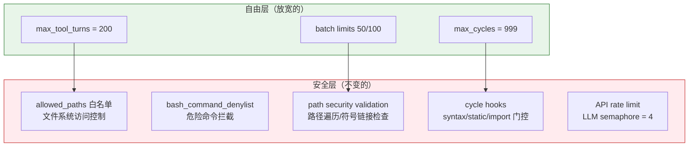
**Figure 6.1 — 限制层次与安全边界**

- **路径白名单**（`allowed_paths`）：无论 batch 限制多大，agent 只能访问 workspace 内的文件
- **命令黑名单**（`bash_command_denylist`）：`rm`、`shutdown` 等危险命令始终被拦截
- **Hooks 质量门**：语法错误、import 失败会阻止 auto-commit
- **API 信号量**：最多 4 个并发 API 调用，防止 rate limit

## 7. 安全加固

### 7.1 Bash Denylist 绕过修复
**漏洞**：原来的 `_denied_command()` 只检查整条命令的第一个 token。攻击者可以用 shell 链接绕过：
```bash
echo hello && rm -rf /    # "echo" 是第一个 token，通过检查
ls | rm -rf /             # "ls" 是第一个 token，通过检查
```

**修复**：将命令按 shell 操作符（`&&`、`||`、`;`、`|`）分割，检查**每一段**的第一个 token：
```python
segments = re.split(r"&&|\|\||[;|]", command)
for segment in segments:
    tokens = segment.strip().split()
    if not tokens:
        continue
    cmd = os.path.basename(tokens[0])
    if cmd in denylist:
        return True  # 拒绝
```

### 7.2 Glob 路径逃逸防护
**漏洞**：glob 搜索结果未验证是否在 `allowed_paths` 内。如果 workspace 内有符号链接指向外部目录，glob 会返回外部文件。

**修复**：glob 结果现在逐条验证：
```python
allowed = [Path(p).resolve(strict=False) for p in config.allowed_paths]
for m in raw_matches:
    m_resolved = m.resolve()
    if any(m_resolved == a or m_resolved.is_relative_to(a) for a in allowed):
        matches.append(m)
```

额外改进：输出改为**相对路径**（相对 workspace），不泄露绝对路径。

### 7.3 Grep 路径验证与文件上限
**漏洞 1**：grep 搜索结果的文件路径未做符号链接解析验证。

**漏洞 2**：无文件数量上限，在巨大 repo 上可能耗尽内存。

**修复**：
- 每个匹配文件路径解析后验证是否在 `allowed_paths` 内
- 新增 `MAX_GLOB_FILES = 5000` 硬上限，超出时截断并在输出末尾追加警告

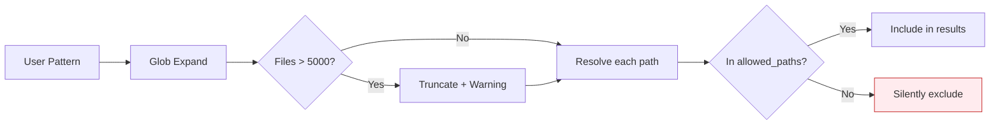
**Figure 7.1 — Grep 安全验证链路**

## 8. Pipeline 模式增强

### 8.1 Debate 获得工具访问权
这是 pipeline 模式最大的质变。之前 debate 模式（编排/评审 phase）只能做纯文本推理——LLM 看到注入的 `$file_context`，但无法主动读文件或搜索代码。
现在 debate 模式拥有**只读工具集**：
```python
_READ_ONLY_TAGS = frozenset({"file_read", "search", "git", "analysis"})
```
这意味着编排者可以：
- `batch_read` 主动阅读代码
- `grep_search` 搜索特定模式
- `git_diff` 查看最近改动
- `code_analysis` / `cross_reference` 分析调用图

同时保持安全：debate 无法写文件或执行 bash，只能看不能改。Tool turns 上限设为 30（debate 不需要 200 轮）。

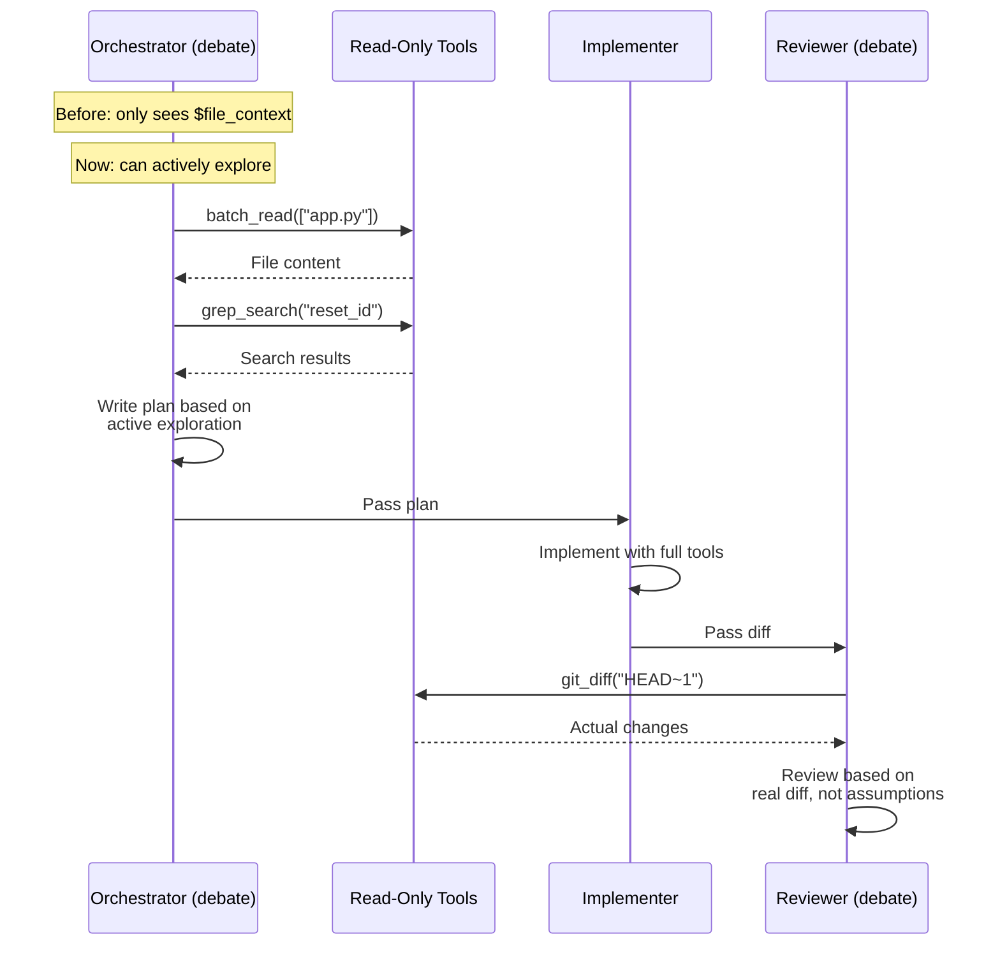
**Figure 8.1 — Debate 工具访问流程**

### 8.2 文件清单代替全量注入
当 debate 有了工具访问权，就不再需要把整个 codebase 注入 `$file_context`（通常 50K+ 字符）。新增 `_read_source_manifest()` 函数生成轻量级文件清单：
```
=== Source File Manifest (23 files) ===
bridge/dispatcher/app.py  (560 lines, 18.2KB)
bridge/dispatcher/task_planner.py  (340 lines, 11.1KB)
bridge/tests/test_phantom.py  (45 lines, 1.8KB)
...

You have tool access — use batch_read to inspect files.
```
清单只有路径和大小（约 2K 字符 vs 50K+ 全量内容），agent 按需 `batch_read` 感兴趣的文件。

### 8.3 Memory Insight 深度提升
Pipeline 的跨轮记忆（`memory.py`）为每个 phase 结果保存一段 insight。之前所有 phase 统一截断到 400 字符，导致设计类 phase 的关键分析被切掉。
现在按 phase 类型差异化：
```python
insight_limit = (
    2000 if any(k in label for k in ("design", "orchestrate"))
    else 800
)
```
设计/编排类保留 2000 字符的完整分析，执行/评审类保留 800 字符。显示时统一截断到 600 字符，但存储保持完整。

### 8.4 Evaluator 适配 Batch 工具
评审器（`evaluator.py`）需要理解 batch 工具的输出格式来提取变更信息：
- `_VERBOSE_TOOLS` 新增 `batch_read`
- `_IMPORTANT_TOOLS` 新增 `batch_edit`、`batch_write`
- 日志摘要针对 batch 输入生成：`"3 files"` / `"5 edits"`
- `_extract_before_snapshots()` 重写，能解析 batch_read 的多文件输出格式，按 `--- path [...] ---` 分割
- `_strip_line_numbers()` 同时处理 read_file 和 batch_read 两种行号前缀格式

### 8.5 Meta-Review 错误处理修复
Pipeline 的 meta-review（每 N 轮暂停审视全局进展）有两个 bug 被修复：
- LLM 调用未做异常保护——一次 API 失败会crash整个 pipeline。现在用 try/except 包裹，失败时 log warning 并返回空字符串
- 写入 artifacts 时误写了 `response`（完整 LLM 响应对象）而非 `response.text`（纯文本）

## 9. 运维入口：harness-gdc.sh

### 9.1 三模式交互菜单
`./harness-gdc.sh start` 不带参数时弹出交互选择：
```
┌──────────────────────────────────────────┐
│          Harness → ExampleProject               │
├──────────────────────────────────────────┤
│  1) pipeline  — orchestrate→implement→review │
│  2) agent     — fully autonomous agent       │
│  3) simple    — one-shot task                │
└──────────────────────────────────────────┘

Select mode [1/2/3]:
```
也可以直接指定：`./harness-gdc.sh start agent`。

### 9.2 进程管理与模式追踪
三个状态文件追踪运行状态：
- `.harness-gdc.pid` — 进程 PID
- `.harness-gdc.log` — 标准输出/错误日志
- `.harness-gdc.mode` — 当前运行模式（`pipeline` / `agent` / `simple`）

`status` 命令显示模式信息：
```
✅  Running (PID 38266, mode: agent)
   log: /home/user/harness/.harness-gdc.log
```

### 9.3 启动前置检查
`cmd_start()` 在启动前执行三项检查：
1. **API 密钥**：从 Apps Studio SQLite DB 读取 `llm.apiKey`
2. **代理**：检查 REDACTED-proxy 是否在 :9099 监听，未运行则自动启动
3. **分支**：确保 ExampleProject 在 `feat/harness` 分支

### 9.4 优雅停止三级升级
`cmd_stop()` 实现递进式关机：

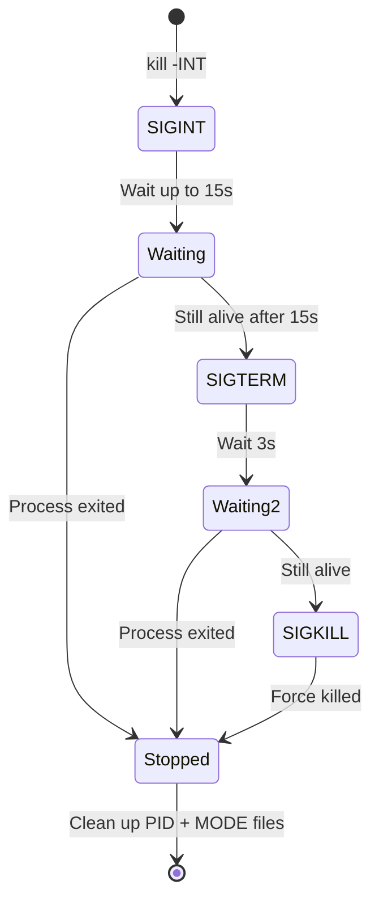
**Figure 9.1 — harness-gdc.sh 停止状态机**

- **SIGINT**（Ctrl-C）：让 harness 完成当前 cycle/phase，然后干净退出
- **SIGTERM**：15 秒后仍在运行，发送终止信号
- **SIGKILL**：3 秒后仍存活，强制杀死

## 10. 总结与展望

### 10.1 交叉主题
回顾今天的全部变更，浮现出五个贯穿各模块的设计主题：

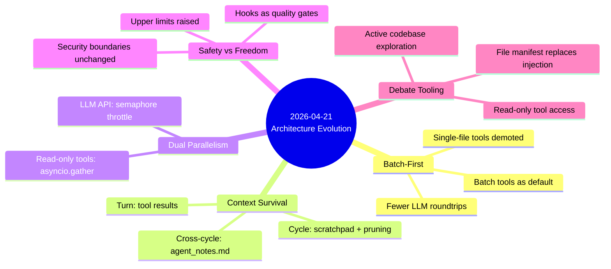
**Figure 10.1 — 五大交叉设计主题**

**Batch-first 哲学**：单文件工具降级为可选，batch 等价物成为默认。每次工具调用做更多事，减少 LLM 交互轮次，腾出 turn 预算给真正的思考和编码。

**上下文生存策略**：三层防线保护信息不丢失——turn 级的工具结果、cycle 级的 scratchpad + 对话修剪、跨 cycle 的 agent_notes.md。每一层都有明确的生存范围和容量限制。

**双层并行**：turn 内只读工具通过 asyncio.gather 并行；跨 caller 的 LLM API 请求通过信号量节流。两个层次各解决不同的性能瓶颈。

**安全与自由的分层**：上层放宽（cycles、turns、batch 大小），底层不变（路径白名单、命令黑名单、hooks 门控）。Agent 可以做更多事，但不能做不该做的事。

**Debate 工具化**：编排者和评审者从"看文本推理"升级为"主动探索代码"，这是 pipeline 模式质量提升的关键一步——评审者现在能跑 `git diff` 看真实变更，而不是猜测。

### 10.2 下一步
当前 Agent 模式的 mission 是泛化的"持续改进"，与 pipeline 功能重叠。下一步演进方向：
- **具体大任务导向**：给 agent 一个明确的端到端任务（如"完整重写错误恢复系统"），发挥 agent 模式在连续工作流上的优势
- **交互式 mission 输入**：每次启动时输入 mission，而非固定写在 config 里
- **跨 cycle 评估**：在不引入评分机制的前提下，让 agent 定期自我审视进展质量
- **多 agent 协作**：多个 agent 各负责一个子系统，共享 git 仓库但独立运行
